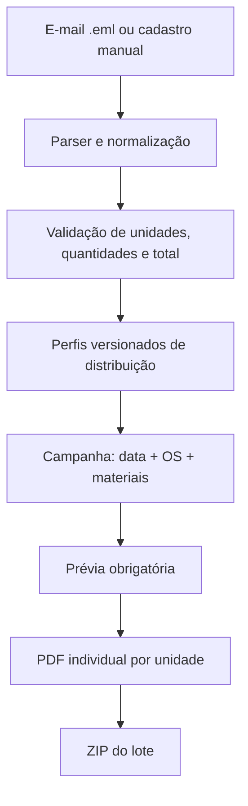

# Retail Protocol Automation

[](https://github.com/lopeslyra10/retail-protocol-automation/actions/workflows/ci.yml)


Aplicação para transformar listas operacionais de distribuição em protocolos individuais em PDF, com importação de e-mails, validação de regras de negócio e entrega consolidada em ZIP.

> Este repositório é uma edição de portfólio baseada em um fluxo real. Nomes, endereços, números de OS, quantidades e mensagens foram substituídos por dados sintéticos.

## O problema de negócio

Uma operação varejista multiloja precisava distribuir materiais promocionais entre unidades com frequências, quantidades e coberturas diferentes. O processo original dependia de edição manual e possuía quatro fontes recorrentes de erro:

- uma campanha podia atender todas as unidades, enquanto outra atendia somente parte delas;
- vários materiais e ordens de serviço podiam compartilhar o mesmo protocolo;
- as quantidades mudavam a cada ciclo e chegavam em e-mails encaminhados, com tabelas duplicadas ou desalinhadas;
- cada unidade precisava receber um PDF próprio, o que tornava a preparação repetitiva e vulnerável a troca de endereço, quantidade ou versão.

O modelo inicial resolvia apenas cenários fixos. Quando surgiram combinações com dois, três ou mais materiais, a limitação deixou de ser de interface e passou a ser de modelagem: OS, materiais e perfis de quantidade precisavam ser coleções independentes.

## A solução

O sistema foi redesenhado como um montador dinâmico de protocolos:

1. o usuário importa ou cadastra perfis versionados de quantidade;
2. cada perfil define exatamente quais unidades participam da distribuição;
3. uma campanha aceita qualquer quantidade de OS e materiais;
4. cada material aponta para seu próprio perfil de quantidade;
5. uma prévia precisa ser aprovada antes da geração em lote;
6. o serviço produz um PDF por unidade elegível e compacta os arquivos em um ZIP.



## Por que essas decisões

| Decisão | Motivação | Resultado |
| --- | --- | --- |
| Perfis de quantidade independentes | Quantidades e unidades participantes variam por material | Um protocolo combinado mostra somente os materiais aplicáveis a cada unidade |
| Coleções dinâmicas de OS e materiais | Limites como “2 em 1” criavam novas exceções a cada campanha | O mesmo domínio atende um ou muitos itens sem novos modos fixos |
| Pydantic na camada de domínio | Dados inválidos não podem chegar ao PDF | OS são normalizadas, IDs são únicos e quantidades precisam ser positivas |
| Parser `.eml` próprio | E-mails reais trazem HTML, texto, encaminhamentos e versões anteriores | Tabelas são deduplicadas e ficam disponíveis para conferência antes de persistir |
| ReportLab | O documento exige controle preciso de A4, bordas, fontes e paginação | O layout é determinístico e materiais extensos continuam em novas páginas |
| Prévia como porta de aprovação | Um ZIP errado multiplica o erro por todas as unidades | A geração final só é liberada após validação humana |
| Escrita atômica do JSON | Uma interrupção durante o salvamento não deve corromper os perfis | O arquivo novo substitui o anterior somente após ser gravado por completo |

## Funcionalidades

- múltiplas OS e múltiplos materiais no mesmo lote;
- inclusão, remoção e reordenação dinâmica de materiais;
- perfis completos ou parciais de unidades;
- edição temporária de quantidades sem alterar o perfil salvo;
- importação de e-mails `.eml` em texto ou HTML;
- associação de unidade por nome, alias ou endereço;
- identificação de versões repetidas no histórico do e-mail;
- separação de listas distintas presentes na mesma mensagem;
- conferência entre total declarado e soma da tabela;
- bloqueio para unidades desconhecidas ou repetidas;
- paginação automática para muitos materiais ou muitas OS;
- prévia obrigatória e geração de ZIP com PDFs individuais;
- marca do documento configurável por variáveis de ambiente.

## Arquitetura

```text
app.py                         Interface e orquestração Streamlit
src/retail_protocols/
├── config.py                  Configuração de apresentação
├── models.py                  Entidades e regras de domínio
├── repository.py              Persistência e validação dos cadastros
└── services/
    ├── email_import_service.py Parsing e reconciliação de e-mails
    ├── quantity_service.py     Importação de listas simples
    ├── pdf_generator.py        Layout, paginação e metadados dos PDFs
    └── zip_service.py          Geração do lote por unidade
data/                          Dados exclusivamente sintéticos
examples/                      E-mail seguro para demonstração
tests/                         Testes de domínio, parser, PDF e ZIP
```

Detalhes adicionais estão em [docs/architecture.md](docs/architecture.md) e as decisões relevantes são registradas em [docs/decisions](docs/decisions).

## Regras de negócio principais

- toda campanha deve ter ao menos uma OS válida e um material;
- OS repetidas são removidas preservando a ordem de entrada;
- cada material precisa ter um identificador único e um perfil não vazio;
- quantidades devem ser inteiras e maiores que zero;
- uma unidade recebe apenas os materiais cujos perfis a incluem;
- ajustes feitos na campanha são temporários e não sobrescrevem o perfil-base;
- a geração ignora unidades que não pertencem a nenhum material do lote;
- e-mails com unidades desconhecidas ou duplicadas não podem ser salvos automaticamente;
- quando o conteúdo excede uma página A4, o documento cria continuações legíveis em vez de reduzir excessivamente a fonte.

## Tecnologias

- Python 3.11+
- Streamlit
- Pydantic v2
- ReportLab
- Pytest
- Ruff
- GitHub Actions

## Executar localmente

### Windows

Clone o repositório e execute `INICIAR_APP.bat`. Na primeira execução, o script cria a `.venv` e instala as dependências.

### Linux ou macOS

```bash
git clone https://github.com/lopeslyra10/retail-protocol-automation.git
cd retail-protocol-automation
chmod +x INICIAR_APP.sh
./INICIAR_APP.sh
```

### Instalação manual

```bash
python -m venv .venv

# Windows
.venv\Scripts\activate

# Linux/macOS
source .venv/bin/activate

python -m pip install -r requirements.txt
python -m streamlit run app.py
```

## Testar a importação de e-mail

1. abra a aba **Listas de quantidades**;
2. envie [`examples/sample_distribution.eml`](examples/sample_distribution.eml);
3. confira OS, período, três unidades e total de 1.050;
4. carregue a distribuição no formulário e revise antes de salvar.

O arquivo de exemplo usa somente identidades e endereços fictícios.

## Qualidade

```bash
python -m pip install -r requirements-dev.txt
python -m ruff check .
python -m ruff format --check .
python -m pytest
```

A integração contínua executa lint, verificação de formatação e testes em Python 3.11 e 3.12 a cada push ou pull request para `main`.

## Limites conscientes e próximos passos

A edição atual utiliza JSON local porque o primeiro objetivo era validar o fluxo operacional com baixa complexidade de implantação. Essa escolha funciona bem para uso local e volume moderado, mas não oferece concorrência distribuída nem persistência confiável em hospedagens efêmeras.

Evoluções planejadas:

- persistência em PostgreSQL com migrações;
- autenticação e trilha de auditoria;
- armazenamento de artefatos em object storage;
- telemetria de erros de importação e tempo economizado por lote;
- testes visuais de regressão para o PDF;
- implantação containerizada.

## Segurança e privacidade

- nenhum e-mail operacional foi versionado;
- todos os nomes, endereços, OS e volumes deste repositório são sintéticos;
- segredos locais devem ficar em `.streamlit/secrets.toml` ou variáveis de ambiente;
- arquivos gerados e configurações sensíveis estão cobertos pelo `.gitignore`.

## Autor

Desenvolvido por [Augusto Lopes Lyra](https://github.com/lopeslyra10) como estudo de automação de processos, modelagem de regras de negócio, tratamento de dados semiestruturados e geração programática de documentos.

## Licença

Distribuído sob a licença MIT. Consulte [LICENSE](LICENSE).
