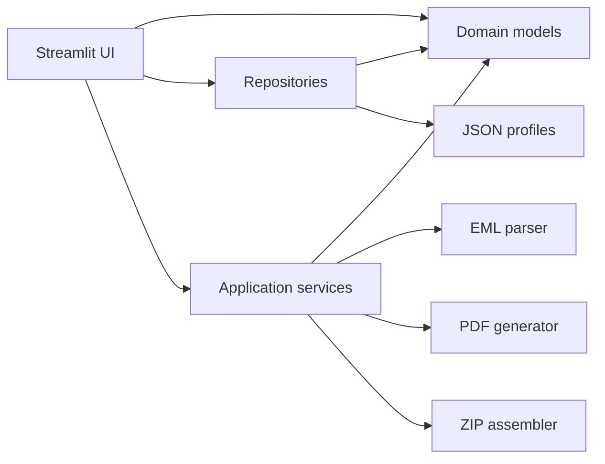

# Arquitetura

## Visão geral

O projeto adota uma separação simples entre interface, domínio, persistência e serviços de saída. A intenção é manter as regras críticas testáveis sem depender do ciclo de execução do Streamlit.

## Componentes

### Interface

`app.py` controla estado de sessão, formulários dinâmicos, prévia e downloads. A interface converte entradas em objetos do domínio; ela não implementa paginação de PDF nem regras de validação de campanha.

### Domínio

`models.py` contém `Store`, `QuantityProfile`, `ProtocolItem` e `Campaign`. As validações impedem quantidades não positivas, perfis vazios, itens duplicados e campanhas sem OS.

### Persistência

Os repositórios isolam leitura, ordenação, validação de chaves e escrita. O salvamento de perfis usa arquivo temporário e substituição atômica para reduzir o risco de corrupção.

### Importação

O parser de e-mail trabalha em etapas:

1. valida tamanho e estrutura MIME;
2. extrai corpos `text/plain` e `text/html`;
3. encontra tabelas ou seções rotuladas;
4. normaliza nomes e endereços;
5. associa linhas ao cadastro de unidades;
6. remove tabelas duplicadas do histórico;
7. identifica OS, período, categoria e totais declarados;
8. entrega um resultado imutável para conferência.

### Documentos

O gerador ReportLab calcula a capacidade da página, cria páginas de índice para muitas OS e páginas de continuação para muitos materiais. O serviço ZIP filtra unidades elegíveis antes de solicitar cada PDF.

## Fronteiras e dependências

- o domínio não importa Streamlit nem ReportLab;
- o parser não escreve em disco;
- o gerador de PDF recebe objetos já validados;
- a persistência não conhece componentes de interface;
- somente a camada de interface coordena o fluxo completo.

## Estratégia de testes

Os testes cobrem:

- normalização e invariantes do domínio;
- perfis completos e parciais;
- associação por nome, alias e endereço;
- e-mails HTML, texto simples, revisões e múltiplas listas;
- paginação de materiais e OS;
- conteúdo e quantidade de arquivos no ZIP;
- persistência de novos perfis;
- importação do arquivo de demonstração versionado.

## Escalabilidade

O desenho atual é adequado para uma ferramenta local de operação. Para execução multiusuário, o contrato do repositório permite substituir JSON por um banco transacional sem alterar os modelos ou os serviços de geração. PDFs e ZIPs podem ser enviados a uma fila e armazenados fora do processo quando o volume justificar processamento assíncrono.
